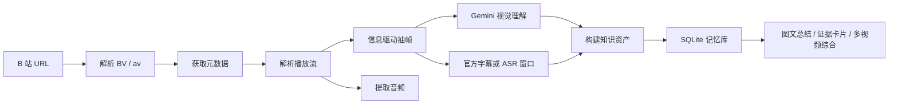

# 视频知识资产工作台 Demo 架构

## 1. 产品目标

这个 Demo 把一个公开 B 站长视频 URL 变成可复用的“知识资产”。评审应能看到三件事：

1. 同一个视频只处理一次，后续生成直接复用已保存资产层。
2. 系统会抽取视觉信息，而不是只依赖字幕或音频。
3. 多个视频资产可以一起生成对比分析。

## 2. 页面结构

### 首页 `/`

- 输入 B 站视频 URL、BV 号或 av 号。
- 创建资产前按 `bvid/cid` 或 `aid/cid` 查重；已存在时直接复用。
- 展示资产列表、状态、删除按钮和处理流程说明。

### 资产页 `/assets/[id]`

- 展示元数据：标题、UP 主、时长、分 P、封面地址。
- 提供处理按钮：抽取关键帧、视觉分析、提取音频、抓官方字幕、音频 ASR、构建资产。
- 按当前状态禁用不合适的按钮，并提示推荐下一步。
- 展示关键帧、字幕/转写片段、知识条目、源媒体和状态机。

### 生成页 `/generate`

- 可选择一个或多个已保存资产。
- 支持三种输出：
  - 图文总结
  - 证据卡片
  - 多视频综合
- 生成页会明确显示：本次没有重新处理视频，只复用了已保存的元数据、关键帧、字幕/转写片段和知识条目。

## 3. 处理流程



## 4. 信息驱动选帧策略

固定间隔抽帧不算完成视觉理解，所以当前实现使用混合候选策略：

- `ffmpeg` 场景变化检测：捕捉镜头、幻灯片、图表、代码、白板状态变化。
- B 站弹幕峰值：从弹幕热度曲线中抽取观众密集反应的时间点。
- 时间线兜底：只在场景/弹幕信号稀疏时补少量覆盖点，避免长视频后半段完全漏掉。
- Gemini 视觉评分：每帧输出摘要、画面文字、视觉类型、信息密度、保留理由和“仅画面可见事实”。

资产页会展示每帧的候选来源、信号、信息密度和可溯源时间戳。

## 5. 字幕 / 音频 / ASR 策略

- 需要 ASR 时先提取完整音频到本地。
- 如果有官方字幕，优先抓官方字幕。
- 为避免文本过大，Demo 只保留关键帧前后窗口内的字幕/转写片段。
- 如果没有官方字幕，可基于已保存音频窗口做 ASR。
- 文本层会写入 manifest，资产页显示来源是“B 站官方字幕”还是“基于已保存音频的 ASR 转写”。

## 6. 状态机

状态顺序：

`已创建 -> 元数据 -> 流已解析 -> 媒体已取 -> 已抽帧 -> 视觉完成 -> 文本完成 -> 资产完成 -> 可复用`

按钮会根据状态禁用。例如：

- 没有元数据时不能抽帧或提取音频。
- 没有关键帧时不能视觉分析，也不能做 ASR 窗口。
- 没有视觉理解时不建议构建知识资产。
- 已构建或可复用的资产可直接进入生成页。

## 7. 数据存储

SQLite 保存结构化层：

- `assets`：视频来源、元数据、状态、错误信息。
- `frames`：关键帧时间戳、图片路径、候选来源、视觉分析。
- `segments`：字幕或 ASR 片段，带开始/结束时间。
- `knowledge_items`：事实、论点、视觉事实、时间线、行动项，并引用帧或文本片段。
- `outputs`：每次生成结果，证明资产可以反复复用。

媒体文件保存到：

```text
public/assets/{assetId}/frame-xxxxx.jpg
public/assets/{assetId}/audio-full.mp3
public/assets/{assetId}/official-subtitles.json
public/assets/{assetId}/transcript-manifest.json
```

## 8. 失败降级

- B 站流获取失败：保留元数据资产，并显示恢复建议。
- 无官方字幕：提示先提取音频，再做 ASR。
- Gemini 不可用：使用已保存的关键帧、字幕和知识条目做本地 fallback 生成。
- ffmpeg 或网络失败：状态会进入失败，并保留可重试入口。
