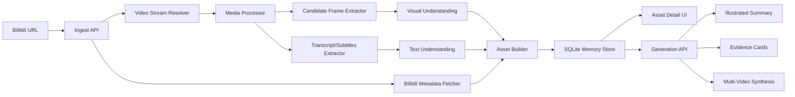

# Knowledge Clip Studio Demo Architecture

## 1. Product Goal

Knowledge Clip Studio turns a public Bilibili long-video URL into a reusable knowledge asset.

The demo must prove three things:

1. A video is processed once, then reused for multiple outputs.
2. Visual information is extracted from frames, not only from subtitles or audio.
3. Multiple video assets can be queried or synthesized together.

The system is optimized for a 24-hour exam: a complete, explainable workflow is more important than broad feature coverage.

## 2. Recommended Scope

### Must Ship

- Bilibili URL intake.
- Video metadata fetch.
- Video asset list and asset detail page.
- Processing pipeline with visible status.
- Key frame extraction with timestamp, OCR/visual description, and retention reason.
- Text transcript/subtitle ingestion when available.
- SQLite-based memory store.
- Two output modes:
  - Illustrated summary.
  - Custom mode: Evidence Cards.
- Same-video reuse without reprocessing.
- Multi-video synthesis.
- README with setup, demo URL, design choices, failure handling, AI collaboration notes, and discarded plans.

### Cut From 24h Version

- User account system.
- Cloud storage.
- Perfect real-time job cancellation.
- Fine-grained manual annotation workflow.
- Full production-grade vector database.
- Complex video editor timeline.

## 3. System Shape

Use a single full-stack web app for the demo.

Recommended stack:

- Frontend: Next.js App Router + React + TypeScript.
- Backend: Next.js route handlers or server actions.
- Database: SQLite via Prisma or Drizzle.
- File storage: local `data/assets`.
- Video processing: `ffmpeg`.
- Bilibili access: public web APIs.
- AI model: Gemini API.
- OCR: start with model-based visual extraction; optionally add local OCR if time allows.

This keeps startup simple:

```bash
npm install
npm run dev
```

Optional:

```bash
npm run seed
```

Only if we want preloaded demo assets.

## 4. High-Level Architecture



## 5. Core Pages

### `/`

Purpose: URL intake and existing asset list.

Main UI:

- URL input.
- Analyze button.
- Recent assets.
- Asset processing status.
- Error messages with recovery suggestions.

### `/assets/[id]`

Purpose: review a reusable video asset.

Main UI:

- Metadata: title, UP, duration, tags, cover.
- Processing status.
- Timeline of transcript segments.
- Key frame gallery.
- Each key frame shows:
  - screenshot,
  - timestamp,
  - OCR/visual notes,
  - why it was retained,
  - linked transcript segment.
- Ask box scoped to this asset.

### `/generate`

Purpose: create outputs from one or more assets.

Main UI:

- Asset selector.
- Output mode selector.
- Prompt/focus input.
- Generate button.
- Rendered output with citations.

Output modes:

- Illustrated Summary.
- Evidence Cards.
- Cross-video synthesis when multiple assets are selected.

## 6. Processing Pipeline

### Step 1: Parse URL

Extract `bvid` or `aid`.

Accepted inputs:

- `https://www.bilibili.com/video/BV...`
- URLs with query parameters.
- Raw BV id as a convenience.

### Step 2: Fetch Metadata

Use:

```text
https://api.bilibili.com/x/web-interface/view
```

Store:

- title,
- desc,
- owner name,
- duration,
- cover,
- tags if available,
- pages/cid.

### Step 3: Resolve Play URL

Use:

```text
https://api.bilibili.com/x/player/playurl
```

Resolve stream URL for the selected page/cid.

Fallback:

- If direct stream resolution fails, keep metadata-only asset and show a clear error.
- Demo can still show already processed seeded assets.

### Step 4: Download or Sample Video

Save under:

```text
data/assets/{assetId}/source.mp4
```

For 24h demo, cap processing:

- Prefer first 10-20 minutes for very long videos.
- Store this limitation clearly in README.
- Keep full metadata so the limitation is explicit.

### Step 5: Candidate Frame Extraction

Do not use fixed interval sampling as the final strategy.

Use an information-driven candidate strategy:

1. Scene change detection.
2. OCR/text density changes.
3. Large visual difference from previous kept frame.
4. Nearby subtitle/segment boundaries.
5. Heuristic priority for slides, code, charts, whiteboards, tables, numbers, diagrams.

Implementation plan:

- Use `ffmpeg` scene detection for first candidate set.
- Add a lightweight fallback frame set only when scene detection returns too few frames.
- Mark fallback frames as fallback candidates; final retained frames must still pass visual scoring.

### Step 6: Visual Understanding

For each candidate frame, ask Gemini vision to return structured JSON:

```json
{
  "summary": "What is visible in the frame",
  "visible_text": ["important text from the image"],
  "visual_type": "slide|chart|code|whiteboard|table|talking_head|other",
  "information_density": 0.0,
  "retention_reason": "Why this frame should or should not be kept",
  "only_in_visual": ["facts visible in the frame that may not appear in speech"]
}
```

Final key frame selection:

- Keep frames with high information density.
- Keep frames with important visual-only facts.
- Deduplicate near-identical frames.
- Limit to a useful number, for example 8-20 key frames per video.

### Step 7: Transcript/Subtitles

Priority:

1. Bilibili subtitles if available.
2. Audio transcription if feasible.
3. Metadata + visual frames only if transcript is unavailable.

The demo should degrade gracefully:

- "No subtitles found; generated output relies on metadata and visual frames."
- "Audio transcription unavailable; visual evidence remains searchable."

### Step 8: Asset Building

Generate structured knowledge:

- facts,
- claims,
- decisions,
- terms,
- action items,
- timeline summary,
- visual evidence.

Each item must cite source anchors:

- segment id,
- frame id,
- timestamp.

## 7. Memory Store

SQLite is enough for the demo. Use local files for screenshots.

### Tables

#### `assets`

- `id`
- `bvid`
- `url`
- `title`
- `description`
- `owner_name`
- `duration`
- `cover_url`
- `status`
- `error_message`
- `created_at`
- `updated_at`

#### `segments`

- `id`
- `asset_id`
- `start_sec`
- `end_sec`
- `text`
- `summary`

#### `frames`

- `id`
- `asset_id`
- `timestamp_sec`
- `image_path`
- `summary`
- `visible_text_json`
- `visual_type`
- `information_density`
- `retention_reason`
- `only_in_visual_json`

#### `knowledge_items`

- `id`
- `asset_id`
- `type`
- `content`
- `source_segment_ids_json`
- `source_frame_ids_json`

#### `outputs`

- `id`
- `mode`
- `asset_ids_json`
- `prompt`
- `content_json`
- `created_at`

## 8. Generation Modes

### Illustrated Summary

Required by the prompt.

Output structure:

- title,
- one-line takeaway,
- key facts,
- argument chain,
- conclusion,
- action suggestions,
- illustrated sections with key frames,
- citations with timestamps.

### Evidence Cards

Custom mode.

Best for:

- technical talks,
- tutorials,
- finance/data videos,
- whiteboard explanations,
- videos where visuals contain information not spoken aloud.

Each card:

- claim,
- screenshot,
- timestamp,
- visible evidence,
- explanation,
- whether the fact came from visual-only, transcript-only, or both,
- follow-up question suggestions.

This mode directly demonstrates visual understanding and source traceability.

### Multi-Video Synthesis

When two or more assets are selected, generate:

- common themes,
- conflicting views,
- unique evidence per video,
- consolidated action list,
- citations grouped by source video.

## 9. API Design

### `POST /api/assets`

Create an asset from URL.

Request:

```json
{
  "url": "https://www.bilibili.com/video/BV..."
}
```

Response:

```json
{
  "assetId": "..."
}
```

### `GET /api/assets`

List assets.

### `GET /api/assets/:id`

Get asset with frames, segments, and knowledge items.

### `POST /api/assets/:id/process`

Run or resume processing.

For the first version this can be synchronous or simple background polling.

### `POST /api/generate`

Generate an output.

Request:

```json
{
  "assetIds": ["asset_1", "asset_2"],
  "mode": "illustrated_summary",
  "prompt": "偏事实和可行动建议"
}
```

Response:

```json
{
  "outputId": "...",
  "content": {}
}
```

### `POST /api/ask`

Ask questions against one or more assets.

Request:

```json
{
  "assetIds": ["asset_1"],
  "question": "画面中的图表显示了什么没有被口播提到的信息？"
}
```

Response includes citations:

```json
{
  "answer": "...",
  "citations": [
    {
      "assetId": "asset_1",
      "kind": "frame",
      "timestampSec": 192,
      "frameId": "frame_1"
    }
  ]
}
```

## 10. Job Status Model

Status values:

- `created`
- `metadata_fetched`
- `video_resolved`
- `media_downloaded`
- `frames_extracted`
- `visual_understood`
- `transcript_ready`
- `asset_built`
- `ready`
- `failed`

The UI should show these as progress steps.

## 11. Failure Handling

### Missing Subtitles

Fallback:

- Use metadata + visual frames.
- If audio transcription is implemented, use transcription.

User message:

```text
No subtitles were found. The asset was created using metadata and visual frames.
```

### Video Download Fails

Fallback:

- Save metadata.
- Show retry.
- Let user inspect the error.

User message:

```text
Could not download the video stream. Check whether the video is public and not region-limited.
```

### Gemini API Fails

Fallback:

- Mark frame as pending visual analysis.
- Keep screenshot.
- Allow retry.

### Too Long Video

Fallback:

- Process capped duration.
- Show the cap in the UI and README.

## 12. Demo Script

The final recording should show:

1. Input a Bilibili URL.
2. Watch processing steps complete.
3. Open asset detail and inspect key frames.
4. Ask a visual-only question and show timestamped citation.
5. Generate Illustrated Summary.
6. Generate Evidence Cards from the same asset without reprocessing.
7. Select multiple assets and generate cross-video synthesis.

## 13. Implementation Milestones

### Milestone 1: App Skeleton

- Next.js app.
- SQLite setup.
- Asset list and asset detail pages.
- Basic API routes.

### Milestone 2: Bilibili Ingestion

- URL parser.
- Metadata fetch.
- Store asset.
- Show status and errors.

Current implementation:

- Parses BV ids, av ids, and regular Bilibili video URLs.
- Calls `https://api.bilibili.com/x/web-interface/view`.
- Best-effort calls `https://api.bilibili.com/x/tag/archive/tags`.
- Stores `aid`, `bvid`, first `cid`, title, description, UP name, duration, cover URL, tags, and page count.
- Advances asset status from `created` to `metadata_fetched`.
- Keeps a failed asset with a visible error message when metadata fetching fails.

### Milestone 3: Media + Frames

- Resolve stream.
- Download/sample video.
- Extract candidate frames.
- Store frame records and screenshots.

Current implementation:

- Adds `POST /api/assets/:id/process`.
- Resolves Bilibili stream URLs through `https://api.bilibili.com/x/player/playurl`.
- Uses `ffmpeg` with Bilibili `Referer` and `User-Agent` headers.
- Samples up to the first 8 minutes and extracts up to 12 candidate screenshots into `public/assets/{assetId}`.
- Stores candidate frame records in SQLite with timestamp and image path.
- Advances status through `video_resolved`, `media_downloaded`, and `frames_extracted`.
- These are candidate frames only. Milestone 4 will add visual scoring/OCR/Gemini understanding to decide which frames are truly worth retaining.

### Milestone 4: Visual Understanding

- Gemini vision call.
- Frame JSON schema.
- Key frame selection and deduplication.

Current implementation:

- Adds `POST /api/assets/:id/vision`.
- Requires `GEMINI_API_KEY` in `.env.local`.
- Sends each extracted candidate screenshot to Gemini vision through `generateContent`.
- Requests strict JSON with `summary`, `visibleText`, `visualType`, `informationDensity`, `retentionReason`, and `onlyInVisual`.
- Persists the analysis back into SQLite frame records.
- Advances asset status to `visual_understood`.
- UI shows visual type, information density, visible text, and visual-only facts per frame.
- Missing API key returns a clear 409 response and keeps candidate frames intact.

### Milestone 5: Knowledge Asset

- Transcript/subtitle ingestion.
- Structured knowledge items.
- Asset detail source traceability.

Current implementation:

- Adds `POST /api/assets/:id/build`.
- Builds a reusable knowledge asset from metadata, transcript segments when present, and Gemini frame analyses.
- Requests strict structured JSON containing `fact`, `claim`, `visual_fact`, `action_item`, `term`, and `timeline` items.
- Persists items into `knowledge_items` with `sourceSegmentIds` and `sourceFrameIds` for traceability.
- Provides a deterministic fallback when Gemini is unavailable, using metadata plus high-density visual frames.
- Advances status to `asset_built`.
- Asset detail page includes a `Build asset` action and shows source frame/segment IDs under every knowledge item.

### Milestone 6: Output Generation

- Illustrated Summary.
- Evidence Cards.
- Multi-video synthesis.

### Milestone 7: Polish + Evidence

- README.
- Demo recording script.
- AI collaboration review.
- Three discarded plans.
- Error handling polish.
